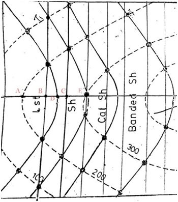

## Post test
Q 1. Determine the angle of dip in the following. 
   
a. 26.565° to North 
<b>b. 63.435° to North</b> 
c. 0° to North 
d. 90° to North  

Q 2. The dip angle is 
<b>a. tan-1(gradient)</b> 
b. sin-1(gradient) 
c. cos-1(gradient) 
d. cot-1(gradient)  

Q 3. Contour lines (thinner lines) between index contours are called 
a. Primary contour lines 
<b>b. Intermediate contour lines</b> 
c. Isolated contour lines 
d. None of the above  

Q 4. Which of the following is true for Direction of dip 
a. Direction in which water would flow if poured onto the plane 
b. Compass direction towards which the plane slopes 
<b>c. Both A and B</b> 
d. None of the above  

Q 5. Contour map is given below based on it answer the following questions with best possible answer. 
  
Scale: 1cm=100m 
Given that: AD=1.80cm, AB=1.15m, BD=0.6cm, DC=0.5cm, CE=1m 
<b>a. 45</b> 
b. 54 
c. 60 
d. 30 
