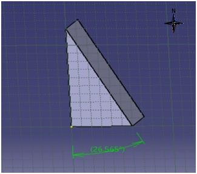
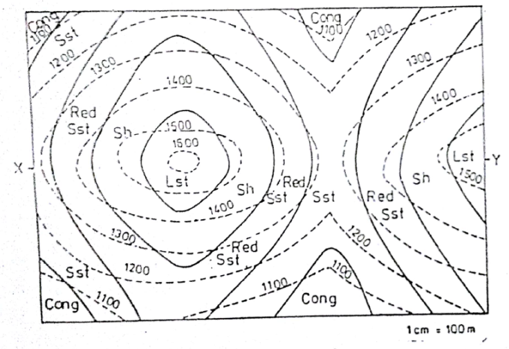

## Post test
Q 1. Determine the angle of dip in the following. 
   
a. 26.565° to North 
<b>b. 63.435° to North</b> 
c. 0° to North 
d. 90° to North  

Q 2. The dip angle is 
<b>a. tan-1(gradient)</b> 
b. sin-1(gradient) 
c. cos-1(gradient) 
d. cot-1(gradient)  

Q 3. Contour lines (thinner lines) between index contours are called 
a. Primary contour lines 
<b>b. Intermediate contour lines</b> 
c. Isolated contour lines 
d. None of the above  

Q 4. Which of the following is true for Direction of dip 
a. Direction in which water would flow if poured onto the plane 
b. Compass direction towards which the plane slopes 
<b>c. Both A and B</b> 
d. None of the above  

Q 5. Based on the fact that “Higher the elevation of rock Younger will be the rock and vice versa.  
Tell which among the following is the youngest rock and he oldest rock from the given contour map.  
Limestone, Shale, Red Sandstone, Conglomerate, Sandstone.

 
a. Youngest: Shale, Oldest: Conglomerate  
<b>b. Youngest: Limestone, Oldest: Conglomerate</b>  
c. Youngest: Sandstone, Oldest: Shale  
d. Youngest: Red Sandstone, Oldest: Conglomerate  
