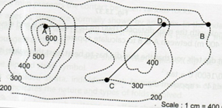

## <b> Pre-test </b>
#### Please attempt the following questions

Q 1. Which is correct about dip and strike? 
<b>a. Both are perpendicular to each other</b> 
b. Both are parallel to each other 
c. Intersect at some angle other than 90 degree 
d. None of above  

Q 2. Relation between true dip and apparent dip 
a. True dip=apparent dip 
<b>b. True dip>apparent dip</b> 
c. True dip<apparent dip 
d. Depends on topographic condition  

Q 3. Determine dip of the line AB (approx.) 
Length of AB=5cm  Scale:1cm=400m 
     
a. 15 degree 
<b>b. 11 degree</b> 
c. 10 degree 
d. 5 degree  

Q 4. Instrument used for contouring? 
a. Compass 
b. Clinometer 
c. Leveller 
<b>d. All of the above</b>  

Q 5. __________is the direction of the line that is formed by the intersection of the plane of the rock bed with a horizontal surface 
a. Dip 
<b>b. Strike</b> 
c. Fold 
d. None of the above  
