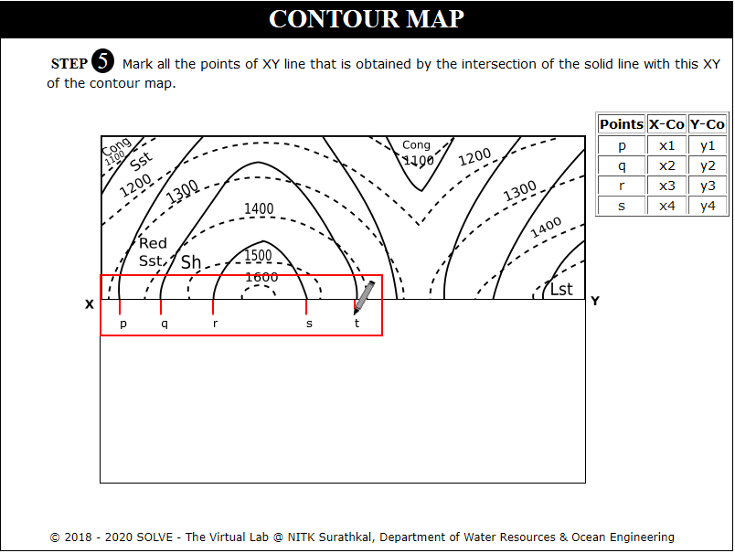

### These procedure steps will be followed on the simulator

#### Contour Map 1
1. When you click on a Contour Map file, click on the Next button at the bottom right corner to move to the next step. 
 

2. Click on rectangular box to select the section where profile is created. Click Next. 
 

3. Click on Get paper to mark dotted lines intersecting the profile.  
 

4. Click on Mark Points to mark dotted lines intersecting the profile. Click Next. 
 

5. Click on Plot X Axis, Plot Y Axis, Points on X Axis and Points on Y Axis to plot axis of the graph. Click Next. 
 

6. Click on Define Coordinates. 
 

7. Click on each point to plot on the graph. 
 

8. Click on Plot Y' X:1535 Y:0 to draw perpendicular line at Y=1535. Click Next. 
 

9. Click on Get paper and Mark Points to mark solid lines intersecting the profile. Click Next. 
 

10. Click on Define Coordinates and name the points p,q,r taking its distance from X as x Coordinate. Click Next. 
 

11. See the formula to determine index of soil. Click Next. 
 

12. Calculate the index value of the highlighted solid lines, click Next. 
 

13. Click on each point to plot points p to u. Click Next. 
 

14. Click join points and Click Next. 
 

15. Click Draw Tunnel to get a horizontal tunnel at 100m altitude. Click Next. 
 

16. Calculate the angle of dip at points on the contour where the solid lines and dotted lines intersect using the formula displayed. Click Next. 
 

17. Click on each stone type to see the distribution, click Next. 
 

18. Click on each label button to see the different graph 
 

#### Contour Map 2

1. When you click on a Contour Map file, a new window will open, click on the Next button at the bottom right corner to move to the next step. 
 

2. Click on rectangular box to select the section where profile is created. Click Next. 
 

3. Click on Get paper and Mark Points to mark dotted lines intersecting the profile. Click Next. 
 

4. Click on Plot X Axis, Plot Y Axis, Points on X Axis, Points on Y Axis to plot axis of the graph. Click Next. 
 

5. Click on Define Coordinates and click on each point to plot on the graph. Click Next. 
 

6. Click on Plot Y' X:1535 Y:0 to draw perpendicular line at Y=1535. Click Next. 
 

7. Click on Get paper and Mark Points to mark solid lines intersecting the profile.Click Next. 
 

8. Click on Define X Coordinates and name the points p,q,r taking its distance from X as x Coordinate.Click Next. 
 

9. Click on If found or if not found based on presence of dotted lines on both sides of solid lines. 
 

10. Calculate Index by selecting appropriate M and N value, click Next. 
 

11. Click on each point to plot points p to x. Click Next. 
 

12. Click on Join points. Click Next. 
 

13. Click to draw horizontal tunnel at 1200m altitude. Click Next. 
 

14. View the formula to calculate angle of dip. 
 

15. Click on each point to find the angle of dip at points where the solid lines intersect the dotted lines, click Next. 
 

16. Draw lines at angle of dip to the X axis Click Next. 
 

17. Click on each stone type to see the distribution, click Next. 
 

18. Click on each label button to see the different graph. 
 
