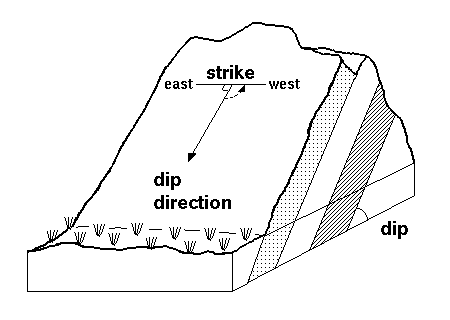

### INTRODUCTION 

A topographic map is a two-dimensional representation of a portion of the three-dimensional surface of the earth. A topographic profile of the earth surface is obtained from topographic profiling. Topographic Profile is a cross-sectional view along a line drawn through a portion of a topographic map. Topographic map alone provides details of underground features such as dip, strike, thickness of the rock formations etc, which will be useful for many practical analyses.

Geologic graphics is the computation of dip, strike and other measurable structural parameters of rock masses by geometrical methods from the topographic map. It helps in determination of the geology of an area comprising of the rock formations, their two dimensional configuration, thickness and sequence at or below the ground surface which are the most important geological data for planning and execution of earth works like cuttings, quarrying, underground works and improvement of site conditions, design, construction and maintenance of complex, costly and vital engineering structures.

Dip and strike of outcrop of rocks are measured with the help of a simple hand held instrument called clinometers compass. A special compass with East and west direction marks reversed with reference to North. Dip and strike of rock masses underground are computed from test borehole data.

<strong>Dip</strong>: it is the angle of inclination of a rock bed with the horizontal plane. The inclination of rock strata from the horizontal is specified by,

The amount of inclination is expressed as gradient like 1 in 5, 1 in 10 etc., more commonly in degree and minutes.

The direction of inclination is expressed full circle bearing like N 150&deg; or more commonly quadrants bearings like N 15&deg; W.

<strong>True Dip (TD)</strong>: It is the measure at right angle to the strike.

<strong>Apparent Dip (AD)</strong>: If the angle is measured in any other direction than the true dip direction.

Dip and Strike of Rock Bed

Source: (<a href="https://geology.fandom.com/wiki/Strike_and_dip">https://geology.fandom.com/wiki/Strike_and_dip</a>)
 

<strong>Strike</strong>: It is the direction of line formed by the intersection of the bedding plane with the horizontal plane. The strike is always at right angle to the true dip. It is stated as N 30&deg; W-S 30&deg; W, S 15&deg; W- N 15&deg; W.

In all inclined beds dip and strike are co existing and they are mutually perpendicular. True dip is the maximum amount of inclination and it is only one which is always perpendicular. True dip is the maximum amount of inclination and it is only one which is always perpendicular to the strike direction. But dips are often measure in the adjacent direction of the true dip. They are always less than the true dip and will be in between true dip and strike directions.

